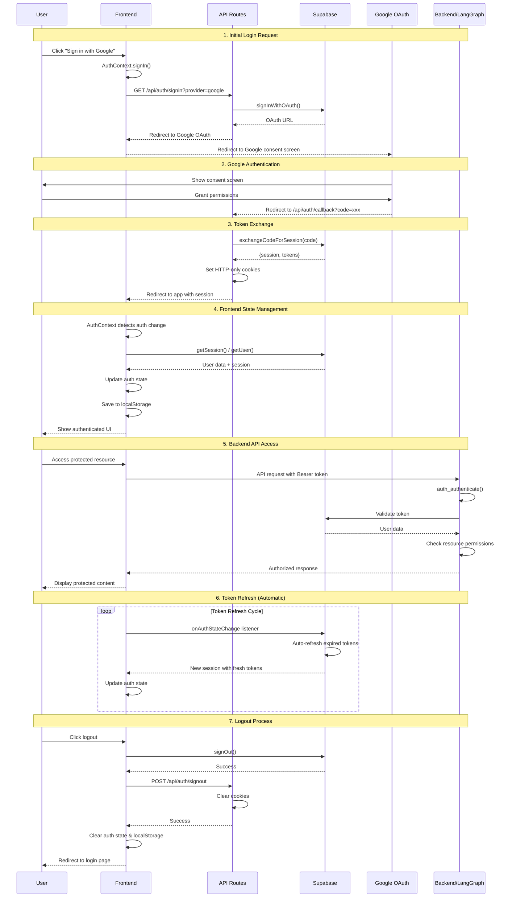
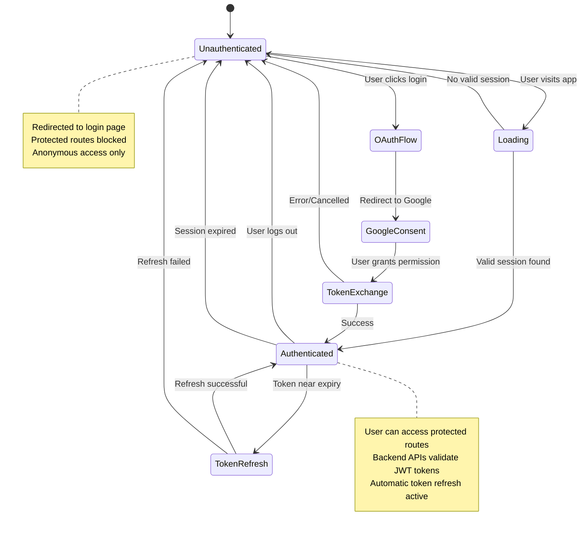

# User Login Flow Process

This document describes the complete authentication and login process for the Thothy application, which uses Supabase for authentication with Google OAuth integration.

## Architecture Overview

The authentication system consists of:
- **Frontend**: Next.js application with React contexts for auth state management
- **Backend**: LangGraph agents with JWT-based authentication
- **Database**: Supabase for user management and authentication
- **OAuth Provider**: Google OAuth for user authentication

## 1. Supabase Google Login Process

### Setup Requirements
- Supabase project with Google OAuth configured
- Environment variables:
  - `NEXT_PUBLIC_SUPABASE_URL`
  - `NEXT_PUBLIC_SUPABASE_ANON_KEY`
  - `SUPABASE_JWT_SECRET`

### OAuth Flow
1. **OAuth Configuration**: Google OAuth is configured in Supabase dashboard
2. **Redirect URLs**: Configured to handle both development and production environments
3. **Token Generation**: Supabase generates JWT tokens with user information
4. **User Metadata**: Google profile information is stored in user metadata

## 2. Frontend Login Process

### Authentication Flow Steps

#### Step 1: User Initiates Login
- User clicks "Sign in with Google" button on login page
- `AuthContext.signIn()` method is called

```typescript
const signIn = useCallback(async () => {
    try {
        const searchParams = new URLSearchParams(window.location.search);
        const redirectTo = searchParams.get('redirectTo') || '/';
        
        window.location.href = `/api/auth/signin?provider=google&redirectTo=${encodeURIComponent(redirectTo)}`;
    } catch (error) {
        console.error("Error signing in:", error);
    }
}, []);
```

#### Step 2: OAuth Initiation
- Browser redirects to `/api/auth/signin` API route
- API route initiates OAuth flow with Supabase

```typescript
const { data, error } = await supabase.auth.signInWithOAuth({
    provider: 'google',
    options: {
        redirectTo: callbackUrl,
        queryParams: {
            access_type: "offline",
            prompt: "consent",
            next: redirectTo,
        },
    },
});
```

#### Step 3: Google Authentication
- User is redirected to Google OAuth consent screen
- User grants permissions to the application
- Google redirects back to the callback URL with authorization code

#### Step 4: Callback Processing
- Callback URL (`/api/auth/callback`) receives the authorization code
- Code is exchanged for session tokens

```typescript
const { data, error } = await supabase.auth.exchangeCodeForSession(code);
```

#### Step 5: Token Storage
- Access and refresh tokens are stored as HTTP-only cookies
- Session information is persisted in browser localStorage

```typescript
cookieStore.set("sb-access-token", data.session.access_token, {
    path: "/",
    secure: process.env.NODE_ENV !== "development",
    httpOnly: true,
    sameSite: "lax",
    maxAge: 60 * 60 * 24 * 7, // 1 week
});
```

#### Step 6: Auth State Management
- `AuthContext` manages authentication state across the application
- User information is enriched with Google profile data

```typescript
const updatedUser = {
    ...currentSession.user,
    user_metadata: {
        ...userMetadata,
        full_name: userMetadata?.full_name || userMetadata?.name || currentSession.user.email,
        avatar_url: userMetadata?.avatar_url || userMetadata?.picture,
    },
};
```

### Route Protection
Protected routes are handled by the middleware and `AuthContext`:

```typescript
const protectedPaths = ['/team', '/find', '/inbox', '/staff', '/blog'];
if (protectedPaths.some(path => pathname?.startsWith(path))) {
    router.push(`/auth/login?redirectTo=${encodeURIComponent(pathname || '/')}`);
}
```

## 3. Backend Login Process

### JWT Authentication
The backend uses JWT token validation for API access:

```python
@auth.authenticate
async def auth_authenticate(authorization: str | None) -> tuple[list[str], Auth.types.MinimalUserDict]:
    """Validate JWT tokens and extract user information."""
    
    scheme, token = authorization.split()
    assert scheme.lower() == "bearer"
    
    payload = jwt.decode(
        token,
        SUPABASE_JWT_SECRET,
        algorithms=[ALGORITHM],
        audience="authenticated",
        leeway=timedelta(seconds=60),
    )
    
    # Verify token with Supabase
    async with httpx.AsyncClient() as client:
        response = await client.get(
            f"{SUPABASE_URL}/auth/v1/user",
            headers={
                "Authorization": f"Bearer {token}",
                "apiKey": SUPABASE_KEY,
            },
        )
    
    user_data = response.json()
    scopes = [payload["role"]]
    
    return scopes, {
        "identity": user_data["id"],
        "email": user_data["email"],
        "display_name": user_data.get("user_metadata", {}).get("full_name"),
        "is_authenticated": True,
    }
```

### Resource Authorization
Backend implements resource-based authorization:

- **Threads**: Users can only access their own threads
- **Assistants**: Read/search access for all, create/update/delete for owners
- **Crons**: Users can only access their own cron jobs

## 4. Token Expiration and Refresh

### Automatic Token Refresh
Supabase SDK handles automatic token refresh:

```typescript
// Auth state change listener handles token refreshes
const { data: { subscription } } = supabase.auth.onAuthStateChange(
    async (event, currentSession) => {
        if (currentSession?.user) {
            // Update user state with refreshed session
            setSession(currentSession);
            setUser(updatedUser);
            saveAuthState(updatedUser, currentSession);
        }
    }
);
```

### Session Validation
Session validation occurs on:
- Page refresh/reload
- Route navigation
- API requests
- Periodic background checks

```typescript
const { data: { session: currentSession }, error } = await supabase.auth.getSession();
```

### Token Expiry Handling
- **Access Token**: Short-lived (1 hour by default)
- **Refresh Token**: Long-lived (7 days as configured)
- **Automatic Refresh**: Handled by Supabase SDK
- **Manual Refresh**: Can be triggered via `supabase.auth.refreshSession()`

## 5. Getting Authentication Data from Supabase

### Client-Side Access
```typescript
// From AuthContext
const { user, session, loading } = useAuth();

// Direct Supabase access
const supabase = createClient();
const { data: { user } } = await supabase.auth.getUser();
const { data: { session } } = await supabase.auth.getSession();
```

### Server-Side Access
```typescript
// In API routes or server components
const supabase = await createClient(); // server client
const { data: { user } } = await supabase.auth.getUser();
```

### Session API Endpoint
```typescript
// GET /api/auth/session
const response = await fetch('/api/auth/session');
const { session } = await response.json();
```

## 6. Authentication Security Considerations

### Security Best Practices

#### 1. Token Security
- ✅ **HTTP-Only Cookies**: Tokens stored in HTTP-only cookies to prevent XSS
- ✅ **Secure Flag**: Cookies marked as secure in production
- ✅ **SameSite Policy**: CSRF protection with SameSite=lax
- ✅ **Token Rotation**: Automatic token refresh and rotation

#### 2. CORS Configuration
- ✅ **Restricted Origins**: CORS configured for specific domains
- ✅ **Credential Handling**: Proper handling of credentials in requests

#### 3. Environment Isolation
- ✅ **Environment Variables**: Sensitive data in environment variables
- ✅ **Development vs Production**: Different configurations per environment

#### 4. Session Management
- ✅ **Session Timeout**: Configurable session expiry
- ✅ **Concurrent Sessions**: Proper handling of multiple sessions
- ✅ **Logout Cleanup**: Complete session cleanup on logout

### Potential Security Risks

#### 1. Token Exposure
- ⚠️ **LocalStorage Usage**: User data stored in localStorage (consider migration to secure storage)
- ⚠️ **Token Logging**: Ensure tokens are not logged in production

#### 2. CSRF Protection
- ✅ **SameSite Cookies**: Provides CSRF protection
- ⚠️ **State Parameter**: Consider adding state parameter to OAuth flow

#### 3. Session Fixation
- ✅ **Token Regeneration**: New tokens generated on login
- ✅ **Session Invalidation**: Old sessions invalidated on logout

## 7. Related Files and Functions

### Frontend Files
```
frontend/src/
├── utils/supabase/
│   ├── client.ts              # Browser Supabase client
│   ├── server.ts              # Server Supabase client
│   └── middleware.ts          # Session management utilities
├── contexts/
│   └── AuthContext.tsx        # Main authentication context
├── app/auth/
│   └── login/page.tsx         # Login page component
└── app/api/auth/
    ├── signin/route.ts        # OAuth initiation
    ├── callback/route.ts      # OAuth callback handler
    ├── signout/route.ts       # Logout handler
    └── session/route.ts       # Session validation
```

### Backend Files
```
backend/security/
├── auth.py                    # LangGraph authentication
└── pyproject.toml            # Dependencies and configuration
```

### Key Functions

#### Frontend Functions
- `AuthContext.signIn()` - Initiates login flow
- `AuthContext.signOut()` - Handles logout
- `createClient()` - Creates Supabase client instances
- `updateSession()` - Middleware session management

#### Backend Functions
- `auth_authenticate()` - JWT token validation
- `auth_on_*()` - Resource authorization handlers
- `_default()` - Default resource filtering

### Environment Configuration
```bash
# Frontend (.env.local)
NEXT_PUBLIC_SUPABASE_URL=your_supabase_url
NEXT_PUBLIC_SUPABASE_ANON_KEY=your_supabase_anon_key

# Backend
SUPABASE_JWT_SECRET=your_jwt_secret
```

## 8. Complete Login Process Flow (Mermaid Diagram)



## 9. Session Flow States



This comprehensive login flow ensures secure authentication with proper token management, automatic refresh capabilities, and robust error handling across both frontend and backend systems. 